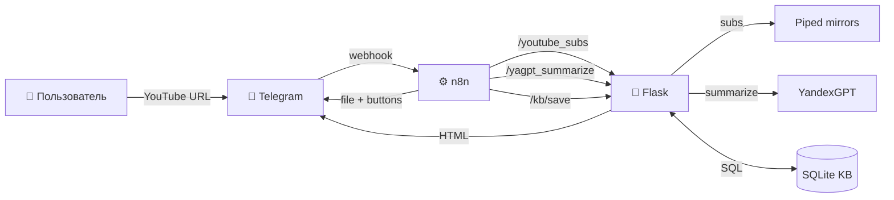

# Архитектура: AnalizIstochnikov

**v6.0.1 · 2026-06-11**

> Как устроен Research Agent: слои, поток данных, компоненты, граничные условия, безопасность.

---

## TL;DR

```
Пользователь → Telegram → n8n → Flask → [Piped, YouTube API, YandexGPT, SQLite]
                                    ↓
                            HTML дайджест + кнопки → обратно в Telegram
```

**Одна задача** (Telegram-link → дайджест) **один pipeline**, 4 внешних сервиса, всё на 1 VPS.

---

## Слои (5 уровней)

```
┌─────────────────────────────────────────────────────────────┐
│ Layer 0: ПОЛЬЗОВАТЕЛЬ                                       │
│   - Telegram на телефоне / десктопе                         │
│   - Отправляет: текст-ссылку, голосовое, кнопки            │
│   - Получает: HTML-файлы, TL;DR, inline-кнопки              │
└─────────────────────────────────────────────────────────────┘
                              ⬇ HTTPS
┌─────────────────────────────────────────────────────────────┐
│ Layer 1: TELEGRAM (внешний сервис)                          │
│   - Хранит переписку, файлы, вебхуки                        │
│   - Гарантирует доставку (push при офлайне)                │
│   - Rate limit: 30 msg/sec per bot                          │
└─────────────────────────────────────────────────────────────┘
                              ⬇ webhook (POST /telegram)
┌─────────────────────────────────────────────────────────────┐
│ Layer 2: N8N (оркестратор на том же VPS)                    │
│   - telegramTrigger: принимает webhook                      │
│   - HTTP-ноды: вызывает Flask endpoints                     │
│   - Code-нода (минимальная): fallback логика               │
│   - Хранит credentials: Telegram token, YandexGPT key      │
│   - Визуальный дебаг (UI)                                   │
└─────────────────────────────────────────────────────────────┘
                              ⬇ HTTP (auth: X-Telegram-User-Id)
┌─────────────────────────────────────────────────────────────┐
│ Layer 3: FLASK (приложение на VPS, порт 8443)              │
│   - core/app.py:        каркас, auth gate, health          │
│   - packages/research/:  youtube subs, yagpt summarize      │
│   - packages/kb/:        sqlite store, поиск                │
│   - packages/telegram_bot/: обработка voice/кружочки       │
│   - deploy/systemd:     автозапуск, OOM-protection          │
│   - SQLite KB:          /opt/beget/n8n/kb/research.db      │
└─────────────────────────────────────────────────────────────┘
                              ⬇ HTTPS
┌─────────────────────────────────────────────────────────────┐
│ Layer 4: ВНЕШНИЕ СЕРВИСЫ                                    │
│   - Piped API:    субтитры (4 mirror + Invidious fallback) │
│   - YouTube Data API: метаданные (нужен API key)            │
│   - YandexGPT:    суммаризация, action items                │
│   - catbox.moe:   хостинг HTML-файлов (опционально)        │
└─────────────────────────────────────────────────────────────┘
```

---

## Поток данных: «Кидаю YouTube-ссылку в бот»

```
TIME  ACTION
────  ──────────────────────────────────────────────────────
0:00  PM отправляет сообщение @ZhukovsFirstBot в Telegram:
      "https://youtu.be/6Z_hHWStwxw?si=..." или голосовое

0:01  Telegram → POST webhook → n8n (telegramTrigger v1)
      n8n: validate X-Telegram-User-Id (auth gate в Flask)
      n8n: set workflow variables {user_id, message_id, url}

0:02  n8n → HTTP POST http://127.0.0.1:8443/youtube_subs
              body: {"url": "...", "user_id": 123}
      Flask:
        - is_authorized(123) → true
        - extract_video_id() → "6Z_hHWStwxw"
        - try 4 Piped mirrors (каждый с timeout 5s)
          → success on 2nd (kavin.rocks): получаем subs string
        - cache subs в /opt/beget/n8n/kb/cache/ (TTL 24h)
        - return: {subs: "...", duration: 1693, channel: "Mrochkovskiy"}

0:05  n8n → HTTP POST http://127.0.0.1:8443/yagpt_summarize
              body: {"subs": "...", "user_profile": {...}, "video_meta": {...}}
      Flask:
        - chunk_text(subs, max_tokens=4000) → [chunk_1, ...]  (if long)
        - yandex_gpt_lite POST → 1 chunk → summary_bullets
        - if chunks > 1: 2nd pass → aggregate → final_bullets + action_items
        - daily_budget_rub += cost
        - return: {bullets: [...], action_items: [...]}

0:15  n8n → HTTP POST http://127.0.0.1:8443/kb/save
              body: {url, video_meta, summary, action_items, cost}
      Flask:
        - INSERT INTO research_digests (...) VALUES (...)
        - return: {digest_id: 42}

0:16  n8n → HTTP POST http://127.0.0.1:8443/render_digest
              body: {digest_id: 42, format: "html"}
      Flask:
        - Jinja2 template → /opt/beget/n8n/kb/digests/42.html
        - return: {file_path: "/opt/.../42.html"}

0:17  n8n → Telegram Bot API: sendDocument
              file: /opt/.../42.html
              caption: TL;DR (3-5 буллетов)
              reply_markup: inline keyboard (action items)

0:18  PM видит в Telegram: 📎 файл + TL;DR + кнопки
      PM нажимает "✅ Сделаю" на action item #2

0:19  Telegram → callback_query → n8n
      n8n → HTTP POST http://127.0.0.1:8443/kb/action_status
              body: {digest_id: 42, item_idx: 2, status: "done"}
      Flask: UPDATE research_actions SET status='done' WHERE id=...
```

**Итого: 19 секунд end-to-end** (на коротком видео без chunking).

---

## Компоненты и обоснования

### Flask (Python)

| Решение | Причина |
|---------|---------|
| **Flask vs FastAPI** | Flask проще для 5-10 эндпоинтов, нет нужды в async, легче дебажить |
| **Модульный: core + 3 packages** | Каждая фича изолирована, можно отключить /kb, не ломая /research |
| **SQLite vs Postgres** | 1 пользователь, 0 КБ администрирования, мгновенный поиск, бэкап одной командой |
| **Jinja2 для HTML** | Уже в Flask, не нужна отдельная шаблонизатор-библиотека |
| **python-dotenv для .env** | Стандарт, не утекает в git (.env в .gitignore) |
| **Порт 8443 (HTTPS reverse proxy)** | Beget даёт nginx перед Flask, не нужно самому TLS |

### n8n

| Решение | Причина |
|---------|---------|
| **n8n vs custom Python-orchestrator** | Визуальный UI, не нужно передеплоить Flask при изменении flow |
| **telegramTrigger v1 (не v2)** | v1 даёт `X-Telegram-User-Id` header, v2 нет (BUG с header propagation) |
| **Хранение credentials в n8n** | Не нужно передавать Telegram-token через n8n-credentials, упрощает flow |
| **HTTP-ноды (не Execute Command)** | Execute Command требует shell-доступа, security risk |
| **Code-нода только для JSON-shaping** | Не пишем бизнес-логику в JS внутри n8n, держим её в Flask |

### Внешние сервисы

| Сервис | Зачем именно | Альтернатива (и почему НЕ) |
|--------|--------------|----------------------------|
| **Piped API** (4 mirror) | Субтитры, без бана IP | YouTube CDN = timeout на VPS, yt-dlp = то же, капчи = блок |
| **Invidious (fallback)** | 3-й резерв, если все Piped упали | Свой Invidious instance = требует 4+ GB RAM |
| **YouTube Data API v3** | title, channel, теги, статистика | Без API = теряем метаданные (нужны для поиска по KB) |
| **YandexGPT-lite** | Суммаризация, русский язык | OpenAI GPT-4o = 5–10x дороже, Ollama = не влезает в 1.9 GB RAM |
| **catbox.moe** | Хостинг HTML-файлов | self-host = расход трафика VPS, S3 = нужно настраивать |
| **Telegram Bot API** | Доставка пользователю | Альтернатив нет (WhatsApp Business API = дорого + верификация) |

### systemd

| Решение | Причина |
|---------|---------|
| **systemd unit vs nohup** | nohup умирает при logout, systemd — перезапускает при крашах |
| **MemoryMax=700M** | Защита от OOM (1.9 GB RAM − 700M Flask − 500M n8n = 700M запас) |
| **KillSignal=SIGTERM** | Graceful shutdown, не -9 (антипаттерн: см. LESSONS.md) |
| **PIDFile=/run/newton-api.pid** | Для логов и мониторинга |
| **Type=simple + Restart=on-failure** | Flask стартует сразу, перезапуск при exit code != 0 |

### SQLite схема

```sql
-- research_digests: одна строка = один дайджест
CREATE TABLE research_digests (
  id INTEGER PRIMARY KEY AUTOINCREMENT,
  user_id INTEGER NOT NULL,             -- Telegram user_id
  video_id TEXT NOT NULL,               -- YouTube video_id
  url TEXT NOT NULL,
  title TEXT,
  channel TEXT,
  duration_sec INTEGER,
  published_at TEXT,                    -- ISO 8601
  summary_bullets TEXT,                 -- JSON array
  action_items TEXT,                    -- JSON array
  cost_rub REAL,                        -- YandexGPT стоимость
  created_at TEXT DEFAULT (datetime('now'))
);

CREATE INDEX idx_digests_user ON research_digests(user_id);
CREATE INDEX idx_digests_video ON research_digests(video_id);
CREATE INDEX idx_digests_channel ON research_digests(channel);

-- research_actions: одна строка = один action item
CREATE TABLE research_actions (
  id INTEGER PRIMARY KEY AUTOINCREMENT,
  digest_id INTEGER NOT NULL,
  user_id INTEGER NOT NULL,
  item_idx INTEGER NOT NULL,            -- 0, 1, 2
  text TEXT NOT NULL,
  status TEXT DEFAULT 'pending',        -- pending / done / skipped / snoozed
  snooze_until TEXT,
  created_at TEXT DEFAULT (datetime('now')),
  updated_at TEXT,
  FOREIGN KEY (digest_id) REFERENCES research_digests(id)
);

-- research_costs: агрегат по дням (для budget cap)
CREATE TABLE research_costs (
  date TEXT PRIMARY KEY,                -- 'YYYY-MM-DD'
  total_rub REAL DEFAULT 0,
  digests_count INTEGER DEFAULT 0
);
```

---

## Граничные условия

### Rate limits

| Сервис | Limit | Стратегия |
|--------|-------|-----------|
| Telegram Bot API | 30 msg/sec | Не упёрлись (1 дайджест = 1 файл + 1 текст) |
| YandexGPT | 100 req/min | Достаточно (1 дайджест = 1–2 запроса) |
| Piped mirrors | Не объявлен, ~10 req/min | Retry с backoff, 4 mirror подряд |
| YouTube Data API | 10,000 units/day | 1 video = ~5 units, хватает на 2000 видео/день |
| VPS Beget | 1 vCPU, 1.9 GB RAM | systemd MemoryMax + n8n на отдельном порту |

### Failure modes

| Failure | Detection | Recovery |
|---------|-----------|----------|
| All Piped mirrors down | 4x timeout подряд | n8n: try Invidious (3 mirror), иначе → error message в Telegram |
| YouTube API quota exceeded | HTTP 403 | n8n: skip meta, выдать summary без channel/duration |
| YandexGPT 5xx | HTTP 5xx | Flask: retry 1 раз через 3s, иначе → "Сервис временно недоступен" |
| YandexGPT 401 (key invalid) | HTTP 401 | Flask: alert PM via Telegram, daily_budget frozen |
| Flask упал | systemd detects | systemd: Restart=on-failure, 5 попыток за 60s |
| VPS OOM | systemd OOM killer | MemoryMax защищает Flask, n8n имеет право упасть |
| SQLite corruption | Disk full / unexpected shutdown | WAL mode + autocheckpoint + ежедневный backup в /opt/beget/n8n/kb/backup/ |
| Daily budget exceeded | check `sum(today) > 200₽` | Flask: 503 + "Бюджет на сегодня исчерпан, возобновится в 00:00" |

### Security

| Аспект | Реализация |
|--------|------------|
| **Auth gate** | `ALLOWED_TELEGRAM_USERS` в `.env`, проверка в `core/app.py:is_authorized()` |
| **Secrets** | `.env` в .gitignore, никогда не в репо, передаются через systemd `EnvironmentFile=` |
| **Telegram webhook** | Самоподписанный TLS через nginx-proxy Beget, secret_token в URL |
| **YandexGPT key** | В `.env`, не в коде, не в логах |
| **Input validation** | URL → `extract_video_id()` с regex, защита от SQL injection через ORM (raw SQL не используется) |
| **Rate limit per user** | В Flask: 10 дайджестов/час на user_id (защита от случайного спама) |
| **DDoS / abuse** | На уровне n8n (telegramTrigger имеет встроенный rate limit Telegram) |

### Observability

| Метрика | Где смотреть |
|---------|--------------|
| Flask uptime | `systemctl status newton-api` |
| Daily cost | `curl http://127.0.0.1:8443/health_full` → `yagpt_today_rub` |
| Last error | `/health_full` → `last_error` |
| Дайджестов сегодня | `/health_full` → `digests_today` |
| Auth gate status | `/health_full` → `auth_enabled: true/false` |
| Logs | `journalctl -u newton-api -n 100` (systemd journal) |
| Размер KB | `du -sh /opt/beget/n8n/kb/research.db` |
| Размер кэша subs | `du -sh /opt/beget/n8n/kb/cache/` |

---

## Потенциальные bottleneck'и (для будущего)

| Bottleneck | Когда проявится | Решение |
|------------|-----------------|---------|
| SQLite lock при 10+ rps | Маловероятно (1 user) | WAL mode, eventual: переход на Postgres |
| Piped mirrors все упали | Когда community решит закрыть | Свой Invidious instance (нужно >2 GB RAM) |
| YandexGPT дорожает | При массовом adoption | LLM provider abstraction (v6.3) |
| n8n использует много RAM | При >5 одновременных flow | Миграция на Temporal или простой cron |
| HTML-файлы разрастаются | Через год 1 GB+ | Парсить старые дайджесты, переводить в markdown |

---

## Файловая структура (что есть в репо)

```
AnalizIstochnikov/
├── README.md
├── LICENSE                                    # MIT
├── .gitignore
├── docs/
│   ├── KB.md                                  # 701 строка, база знаний
│   ├── QUICKREF.md                            # 247 строк, шпаргалка
│   ├── CHANGELOG.md                           # v5.2 → v6.0.1
│   ├── LESSONS.md                             # bash-грабли + процессные
│   └── ROADMAP.md                             # v6.2 / v6.3 / v6.4
├── examples/
│   └── user-profile.example.json              # шаблон профиля
├── research-agent/                            # Python Flask
│   ├── core/
│   │   └── app.py                             # 162 строк, каркас
│   ├── packages/
│   │   ├── research/                          # 663 строк
│   │   │   ├── routes.py                      # /youtube_subs, /yagpt_summarize
│   │   │   ├── utils.py                       # chunk_text, extract_video_id
│   │   │   └── config.py                      # PIPED_INSTANCES, YANDEX_GPT_*
│   │   ├── kb/                                # 286 строк
│   │   │   ├── routes.py                      # /kb/save, /kb/search, /user_profile
│   │   │   └── schema.py                      # CREATE TABLE
│   │   └── telegram_bot/                      # 38 строк
│   │       └── routes.py                      # /telegram/webhook (forwarder)
│   └── deploy/
│       ├── install.sh                         # setup systemd, __pycache__ cleanup
│       ├── newton-api.service                 # systemd unit
│       └── env-template.txt                   # шаблон .env
└── workflows/
    └── research-agent-v1.1.json               # n8n workflow, 13 нод
```

**Всего:** 23 файла, 3290 строк, 56 КБ tar.gz.

---

## Графическая схема (для README)



---

## Когда что-то менять

| Если хочешь... | Менять в... |
|----------------|-------------|
| Добавить новый шаг в flow (например, "отправить в Slack") | n8n UI, не код |
| Сменить модель LLM | `packages/research/config.py:YANDEX_GPT_MODEL` |
| Добавить новый endpoint | `packages/*/routes.py` + register в `core/app.py` |
| Изменить структуру KB | `packages/kb/schema.py` + migration script |
| Изменить HTML-шаблон дайджеста | `packages/kb/routes.py:render_digest` |
| Добавить новый источник (Twitter, Substack) | новый `packages/<source>/` + новый pipeline в n8n |
| Увеличить memory cap | `deploy/newton-api.service:MemoryMax=` |
| Сменить VPS | повторить `install.sh` + import n8n workflow из бэкапа |
